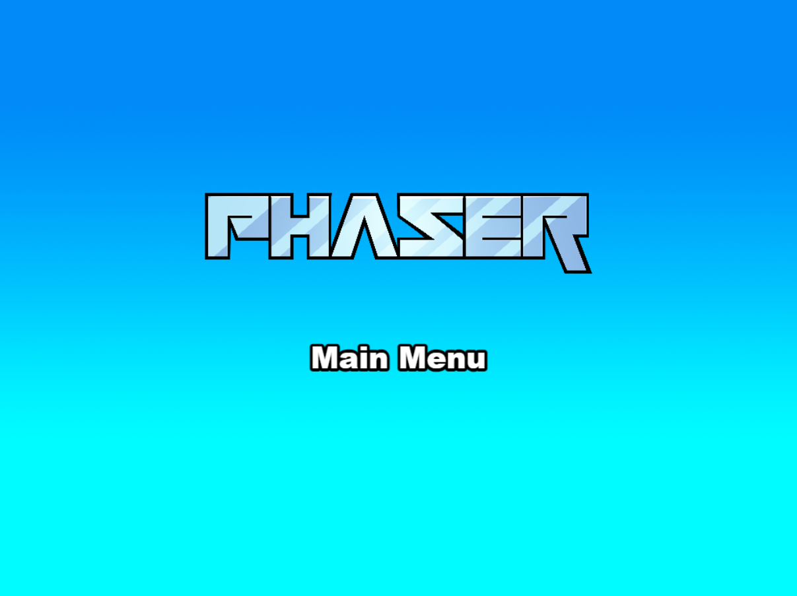

# TvGoshi 🦕

**English** | [Español](#versión-en-español)

## Overview

**TvGoshi** is an interactive virtual pet game built with **Phaser 4** and **Vite**. Inspired by the classic Tamagotchi, it features a digital dinosaur that you can feed, hydrate, and play with using a barcode scanner (HID compatible). The dinosaur's happiness depends on keeping its hunger, thirst, and joy levels balanced.

Perfect for learning Phaser, experimenting with procedural sprite generation, and interactive hardware integration (barcode scanners).



---

## ✨ Features

- 🦕 **Virtual Pet Dinosaur** - Interactive character with personality
- 📊 **Three Core Stats** - Hunger, Thirst, Happiness (0-100%)
- 🎨 **Procedural Sprites** - Dynamically generated dinosaur spritesheet
- 📱 **HID Input Support** - Barcode scanner integration (emulates keyboard)
- ⚡ **Hot Reload** - Instant development feedback with Vite
- 🎬 **Smooth Animations** - 4 action animations + idle state
- 🎯 **4 Barcode Commands** - MEAT, WATER, SALAD, BALL actions
- 🌍 **Cross-Platform** - Works in any modern browser

---

## Quick Start

### Prerequisites

- [Node.js](https://nodejs.org/) (v14+)
- npm or yarn package manager

### Installation

```bash
# Clone the repository
git clone https://github.com/yourusername/tvgoshi.git
cd TvGoshi

# Install dependencies
npm install

# Start development server
npm run dev
```

The game will open at **http://localhost:8080**

### Build for Production

```bash
npm run build
```

Output files will be in the `dist/` folder, ready for deployment.

---

## 🎮 How to Play

### Basic Controls

1. **Barcode Scanner Input** - Scan QR codes or enter codes via keyboard:
   - Press keys to input code
   - Press **Enter** to execute

2. **Supported Codes:**

   | Code | Action | Effect |
   |------|--------|--------|
   | `CARNE` | Feed meat | Hunger -30 |
   | `ENSALADA` | Feed salad | Hunger -15, Happiness +10 |
   | `AGUA` | Give water | Thirst -35 |
   | `PELOTA` | Play ball | Happiness +40 |

3. **Monitor Stats** - Keep an eye on:
   - 🍖 **Hambre (Hunger)** - Decreases 5% every 3 seconds
   - 💧 **Sed (Thirst)** - Decreases 7% every 3 seconds
   - ⚽ **Felicidad (Happiness)** - Decreases 4% every 3 seconds

### Tips

- The dinosaur automatically returns to idle state after each action
- Feed the dinosaur before hunger becomes critical (⚠️ warning icon)
- Balance all three stats for maximum happiness
- Act quickly - stats decay constantly!

---

## 🏗️ Project Structure

```
TvGoshi/
├── index.html                    # HTML entry point
├── src/
│   ├── main.js                   # Legacy bootstrap (deprecated)
│   └── game/
│       ├── main.js              # Phaser config & StartGame factory
│       └── scenes/
│           ├── Boot.js          # Asset pre-loading
│           ├── Preloader.js     # Procedural sprite generation
│           ├── MainMenu.js      # Menu screen
│           ├── Game.js          # Main gameplay logic
│           └── GameOver.js      # End screen (available)
├── public/
│   ├── style.css                # Global styles
│   └── assets/
│       └── bg.png               # Background image
├── vite/
│   ├── config.dev.mjs           # Development config
│   └── config.prod.mjs          # Production config
├── package.json                 # Dependencies & scripts
└── README.md                    # This file
```

---

## 🛠️ Technology Stack

| Technology | Version | Purpose |
|-----------|---------|---------|
| **Phaser** | 4.0.0 | 2D Game Framework |
| **Vite** | 6.3.1 | Module Bundler & Dev Server |
| **Terser** | 5.39.0 | Code Minification |
| **JavaScript** | ES6+ | Programming Language |
| **Canvas API** | Native | Procedural Graphics |

---

## 🎨 Architecture

### Scene Flow

```
Boot Scene
    ↓ (loads background)
Preloader Scene
    ↓ (generates sprites, animations)
MainMenu Scene
    ↓ (player starts game)
Game Scene (Main Loop)
    ├─ Input: Barcode/Keyboard
    ├─ Process: Update stats, animations
    ├─ Display: UI, dinosaur sprite
    └─ Loop: Every frame
    ↓ (optional - when game ends)
GameOver Scene
    ↓ (back to menu)
MainMenu Scene
```

### Core Game Systems

#### 1. **Stat System**
- Three independent stats (0-100% range)
- Automatic decay every 3 seconds
- Color-coded UI with warning indicators

#### 2. **Animation System**
- 4 procedurally generated sprite sheets
- Automatic animation selection based on action
- Auto-return to idle state

#### 3. **Input System**
- HID-compatible barcode scanner support
- Buffered keyboard input
- Enter key triggers command processing

#### 4. **Update Loop**
- Phaser's update cycle handles timing
- Automatic stat decay via timed events
- Real-time UI updates

---

## 📦 Available Scripts

```bash
npm run dev              # Start development server (with telemetry)
npm run dev-nolog       # Start dev server (no telemetry)
npm run build           # Build for production (with telemetry)
npm run build-nolog     # Build for production (no telemetry)
```

---

## 🔌 Integration Guide

### Using a Barcode Scanner

Most USB barcode scanners appear as keyboards to the operating system:

1. **Connect scanner** to USB port
2. **Focus the game window** 
3. **Scan a barcode** - the code will be captured automatically
4. The code processes on **Enter** key (usually automatic with scanners)

### Example Barcodes

You can print or generate these codes:

```
CARNE
AGUA
ENSALADA
PELOTA
```

Or create custom labels with these codes for your scanner setup.

---

## 🚀 Deployment

### Static Hosting (GitHub Pages, Netlify, Vercel)

1. Run `npm run build`
2. Deploy the `dist/` folder contents
3. Your game is live!

### Docker (Optional)

```dockerfile
FROM node:18-alpine
WORKDIR /app
COPY package*.json ./
RUN npm install
COPY . .
RUN npm run build
EXPOSE 8080
CMD ["npm", "run", "dev"]
```

---

## 🐛 Troubleshooting

### Game doesn't load

- Check browser console for errors (F12)
- Verify Node.js version: `node --version`
- Clear node_modules: `rm -rf node_modules && npm install`

### Barcode scanner not working

- Ensure scanner is set to **keyboard mode** (not serial)
- Test in a text editor first to verify input
- Check if Enter key is being sent by scanner

### Animations not showing

- Verify browser supports Canvas API
- Try different browser (Chrome, Firefox, Safari)
- Check asset files exist in `public/assets/`

---

## 📝 Development Notes

### Adding New Barcode Codes

Edit `src/game/scenes/Game.js`:

```javascript
case 'NEWCODE':
    this.stats.hambre = Math.min(100, this.stats.hambre + 25);
    this.dino.play('idle');
    break;
```

### Adjusting Stat Decay

In `Preloader.js`, modify the decay values:

```javascript
decayStats() {
    this.stats.hambre = Math.max(0, this.stats.hambre - 5);  // Change here
    this.stats.sed = Math.max(0, this.stats.sed - 7);        // Or here
    this.stats.felicidad = Math.max(0, this.stats.felicidad - 4);  // Or here
}
```

### Creating Custom Sprites

The dinosaur is generated in `Preloader.js`:

```javascript
createDinoSpritesheet() {
    // Modify colors array here
    const colors = [
        '#4CAF50', '#45A049', // Your custom colors
        // ...
    ];
}
```

---

## 📚 Learning Resources

- [Phaser 4 Documentation](https://docs.phaser.io)
- [Vite Guide](https://vitejs.dev)
- [Canvas API Reference](https://developer.mozilla.org/en-US/docs/Web/API/Canvas_API)
- [Tamagotchi Wiki](https://en.wikipedia.org/wiki/Tamagotchi) - For inspiration!

---

## 🤝 Contributing

Contributions are welcome! Please:

1. Fork the repository
2. Create a feature branch (`git checkout -b feature/amazing-feature`)
3. Commit changes (`git commit -m 'Add amazing feature'`)
4. Push to branch (`git push origin feature/amazing-feature`)
5. Open a Pull Request

### Ideas for Contributions

- ✨ New animations or dinosaur designs
- 🎵 Sound effects and music
- 💾 Persistent storage (localStorage/backend)
- 🏆 Achievements system
- 🎮 Mobile touch controls
- 🌙 Dark/Light mode
- 🌍 Multi-language support

---

## 📄 License

This project is licensed under the **MIT License** - see the [LICENSE](LICENSE) file for details.

---

## 👏 Credits

- **Framework:** [Phaser Studio](https://phaser.io/)
- **Bundler:** [Vite](https://vitejs.dev/)
- **Inspiration:** Classic Tamagotchi virtual pet concept
- **Template Base:** [Phaser Vite Template](https://github.com/phaserjs/template-vite)

---

## 📞 Support & Feedback

Have questions or found a bug?

- Open an [Issue](https://github.com/yourusername/tvgoshi/issues)
- Check existing [Discussions](https://github.com/yourusername/tvgoshi/discussions)
- Create a [Pull Request](https://github.com/yourusername/tvgoshi/pulls)

---

<div id="versión-en-español"></div>

# TvGoshi 🦕

**[English](#overview)** | Español

## Descripción General

**TvGoshi** es un juego de mascota virtual interactiva construido con **Phaser 4** y **Vite**. Inspirado en el clásico Tamagotchi, cuenta con un dinosaurio digital al que puedes alimentar, hidratar y hacer jugar usando un lector de códigos de barras (compatible con HID). La felicidad del dinosaurio depende de mantener balanceados sus niveles de hambre, sed y diversión.

Perfecto para aprender Phaser, experimentar con generación procedural de sprites e integración con hardware interactivo (lectores de códigos de barras).


---

## ✨ Características

- 🦕 **Dinosaurio Mascota Virtual** - Personaje interactivo con personalidad
- 📊 **Tres Estadísticas Base** - Hambre, Sed, Felicidad (0-100%)
- 🎨 **Sprites Procedurales** - Hoja de sprites del dinosaurio generada dinámicamente
- 📱 **Soporte HID Input** - Integración con lector de códigos de barras (emula teclado)
- ⚡ **Recarga en Caliente** - Feedback instantáneo en desarrollo con Vite
- 🎬 **Animaciones Suaves** - 4 animaciones de acción + estado idle
- 🎯 **4 Códigos de Barras** - Acciones CARNE, AGUA, ENSALADA, PELOTA
- 🌍 **Multiplataforma** - Funciona en cualquier navegador moderno

---

## 🚀 Inicio Rápido

### Requisitos Previos

- [Node.js](https://nodejs.org/) (v14+)
- npm o yarn gestor de paquetes

### Instalación

```bash
# Clonar el repositorio
git clone https://github.com/tuusuario/tvgoshi.git
cd TvGoshi

# Instalar dependencias
npm install

# Iniciar servidor de desarrollo
npm run dev
```

El juego se abrirá en **http://localhost:8080**

### Construir para Producción

```bash
npm run build
```

Los archivos se guardarán en la carpeta `dist/`, listos para despliegue.

---

## 🎮 Cómo Jugar

### Controles Básicos

1. **Entrada del Lector de Códigos** - Escanea códigos o ingresa vía teclado:
   - Presiona teclas para introducir código
   - Presiona **Enter** para ejecutar

2. **Códigos Soportados:**

   | Código | Acción | Efecto |
   |--------|--------|--------|
   | `CARNE` | Alimentar carne | Hambre -30 |
   | `ENSALADA` | Alimentar ensalada | Hambre -15, Felicidad +10 |
   | `AGUA` | Dar agua | Sed -35 |
   | `PELOTA` | Jugar | Felicidad +40 |

3. **Monitorea Estadísticas** - Vigila:
   - 🍖 **Hambre** - Disminuye 5% cada 3 segundos
   - 💧 **Sed** - Disminuye 7% cada 3 segundos
   - ⚽ **Felicidad** - Disminuye 4% cada 3 segundos

### Consejos

- El dinosaurio regresa automáticamente al estado idle después de cada acción
- Alimenta el dinosaurio antes de que el hambre sea crítica (icono de ⚠️)
- Equilibra las tres estadísticas para máxima felicidad
- ¡Actúa rápido - las estadísticas decaen constantemente!

---

## 🏗️ Estructura del Proyecto

```
TvGoshi/
├── index.html                    # Punto de entrada HTML
├── src/
│   ├── main.js                   # Bootstrap legacy (deprecated)
│   └── game/
│       ├── main.js              # Config de Phaser & factory StartGame
│       └── scenes/
│           ├── Boot.js          # Precarga de assets
│           ├── Preloader.js     # Generación procedural de sprites
│           ├── MainMenu.js      # Pantalla de menú
│           ├── Game.js          # Lógica principal del gameplay
│           └── GameOver.js      # Pantalla de fin (disponible)
├── public/
│   ├── style.css                # Estilos globales
│   └── assets/
│       └── bg.png               # Imagen de fondo
├── vite/
│   ├── config.dev.mjs           # Config de desarrollo
│   └── config.prod.mjs          # Config de producción
├── package.json                 # Dependencias y scripts
└── README.md                    # Este archivo
```

---

## 🛠️ Stack Tecnológico

| Tecnología | Versión | Propósito |
|-----------|---------|---------|
| **Phaser** | 4.0.0 | Framework de Juegos 2D |
| **Vite** | 6.3.1 | Empaquetador de Módulos y Servidor Dev |
| **Terser** | 5.39.0 | Minificación de Código |
| **JavaScript** | ES6+ | Lenguaje de Programación |
| **Canvas API** | Nativa | Gráficos Procedurales |

---

## 🎨 Arquitectura

### Flujo de Escenas

```
Escena Boot
    ↓ (carga fondo)
Escena Preloader
    ↓ (genera sprites, animaciones)
Escena MainMenu
    ↓ (jugador inicia juego)
Escena Game (Loop Principal)
    ├─ Input: Código de barras/Teclado
    ├─ Proceso: Actualizar stats, animaciones
    ├─ Mostrar: UI, sprite del dinosaurio
    └─ Loop: Cada frame
    ↓ (opcional - cuando termina el juego)
Escena GameOver
    ↓ (volver al menú)
Escena MainMenu
```

### Sistemas Principales del Juego

#### 1. **Sistema de Estadísticas**
- Tres estadísticas independientes (rango 0-100%)
- Decaimiento automático cada 3 segundos
- UI codificada por colores con indicadores de advertencia

#### 2. **Sistema de Animaciones**
- 4 hojas de sprites generadas proceduralmente
- Selección automática de animación según acción
- Retorno automático al estado idle

#### 3. **Sistema de Entrada**
- Soporte compatible con lector de códigos de barras HID
- Entrada de teclado almacenada en buffer
- La tecla Enter activa el procesamiento de comando

#### 4. **Loop de Actualización**
- El ciclo de actualización de Phaser maneja el tiempo
- Decaimiento automático de stats mediante eventos temporizados
- Actualizaciones UI en tiempo real

---

## 📦 Scripts Disponibles

```bash
npm run dev              # Iniciar servidor de desarrollo (con telemetría)
npm run dev-nolog       # Iniciar dev sin telemetría
npm run build           # Construir para producción (con telemetría)
npm run build-nolog     # Construir para producción (sin telemetría)
```

---

## 🔌 Guía de Integración

### Usar un Lector de Códigos de Barras

La mayoría de lectores de códigos de barras USB se comportan como teclados en el sistema operativo:

1. **Conectar lector** a puerto USB
2. **Enfocar la ventana del juego**
3. **Escanear un código de barras** - se capturará automáticamente
4. El código se procesa al presionar **Enter** (usualmente automático con lectores)

### Códigos de Ejemplo

Puedes imprimir o generar estos códigos:

```
CARNE
AGUA
ENSALADA
PELOTA
```

O crear etiquetas personalizadas con estos códigos para tu configuración de escáner.

---

## 🚀 Despliegue

### Hosting Estático (GitHub Pages, Netlify, Vercel)

1. Ejecuta `npm run build`
2. Despliega el contenido de la carpeta `dist/`
3. ¡Tu juego está en vivo!

### Docker (Opcional)

```dockerfile
FROM node:18-alpine
WORKDIR /app
COPY package*.json ./
RUN npm install
COPY . .
RUN npm run build
EXPOSE 8080
CMD ["npm", "run", "dev"]
```

---

## 🐛 Solución de Problemas

### El juego no carga

- Revisa la consola del navegador para errores (F12)
- Verifica la versión de Node.js: `node --version`
- Limpia node_modules: `rm -rf node_modules && npm install`

### Lector de códigos no funciona

- Asegúrate de que el lector esté en **modo teclado** (no serial)
- Prueba primero en un editor de texto para verificar entrada
- Verifica si la tecla Enter se envía desde el lector

### Las animaciones no se muestran

- Verifica que el navegador sea compatible con Canvas API
- Intenta con otro navegador (Chrome, Firefox, Safari)
- Verifica que los archivos de assets existan en `public/assets/`

---

## 📝 Notas de Desarrollo

### Agregar Nuevos Códigos de Barras

Edita `src/game/scenes/Game.js`:

```javascript
case 'CODIGONUEVO':
    this.stats.hambre = Math.min(100, this.stats.hambre + 25);
    this.dino.play('idle');
    break;
```

### Ajustar Decaimiento de Estadísticas

En `Game.js`, modifica los valores de decaimiento:

```javascript
decayStats() {
    this.stats.hambre = Math.max(0, this.stats.hambre - 5);      // Cambiar aquí
    this.stats.sed = Math.max(0, this.stats.sed - 7);           // O aquí
    this.stats.felicidad = Math.max(0, this.stats.felicidad - 4); // O aquí
}
```

### Crear Sprites Personalizados

El dinosaurio se genera en `Preloader.js`:

```javascript
createDinoSpritesheet() {
    // Modifica el array de colores aquí
    const colors = [
        '#4CAF50', '#45A049', // Tus colores personalizados
        // ...
    ];
}
```

---

## 📚 Recursos de Aprendizaje

- [Documentación Phaser 4](https://docs.phaser.io)
- [Guía de Vite](https://vitejs.dev)
- [Referencia Canvas API](https://developer.mozilla.org/es/docs/Web/API/Canvas_API)
- [Wiki Tamagotchi](https://es.wikipedia.org/wiki/Tamagotchi) - ¡Para inspiración!

---

## 🤝 Contribuir

¡Las contribuciones son bienvenidas! Por favor:

1. Haz fork del repositorio
2. Crea una rama de característica (`git checkout -b feature/caracteristica-increible`)
3. Confirma cambios (`git commit -m 'Agregar característica increíble'`)
4. Sube a la rama (`git push origin feature/caracteristica-increible`)
5. Abre un Pull Request

### Ideas para Contribuciones

- ✨ Nuevas animaciones o diseños de dinosaurio
- 🎵 Efectos de sonido y música
- 💾 Almacenamiento persistente (localStorage/backend)
- 🏆 Sistema de logros
- 🎮 Controles táctiles para móvil
- 🌙 Modo oscuro/claro
- 🌍 Soporte multiidioma

---

## 📄 Licencia

Este proyecto está bajo licencia **MIT** - consulta el archivo [LICENSE](LICENSE) para más detalles.

---

## 👏 Créditos

- **Framework:** [Phaser Studio](https://phaser.io/)
- **Empaquetador:** [Vite](https://vitejs.dev/)
- **Inspiración:** Concepto clásico de mascota virtual Tamagotchi
- **Base Template:** [Phaser Vite Template](https://github.com/phaserjs/template-vite)

---

## 📞 Soporte y Retroalimentación

¿Preguntas o encontraste un error?

- Abre un [Issue](https://github.com/tuusuario/tvgoshi/issues)
- Revisa [Discussions](https://github.com/tuusuario/tvgoshi/discussions) existentes
- Crea un [Pull Request](https://github.com/tuusuario/tvgoshi/pulls)

---

**Hecho con ❤️ usando Phaser 4 y Vite**
